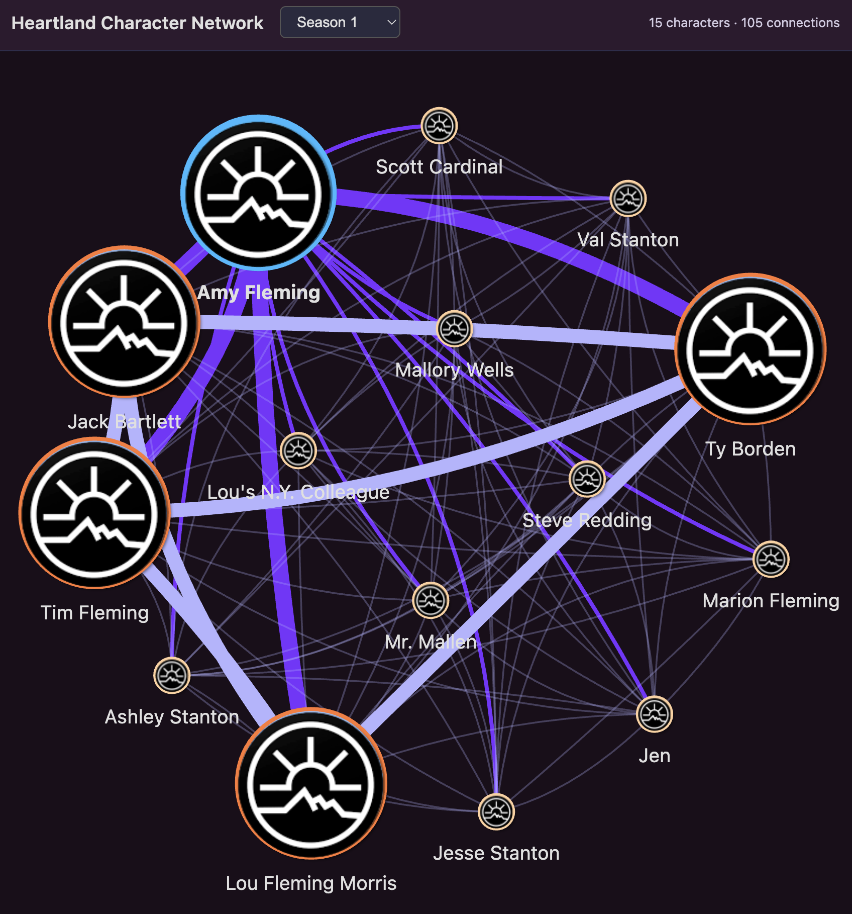

# Heartland Network Graph

A Jupyter notebook to visualise the data for character appearances on [Heartland](https://www.tvmaze.com/shows/3164/heartland)

# Quickstart

```bash
pip3 install -r requirements.txt

python3 -m jupyter notebook heartland_network.ipynb # Or open within IDE if .ipynb files are supported
```

Run all the cells, and the graph will load on http://localhost:3000/data/heartland_network.html

## Graph Design

**Nodes**: Represent characters. Sized and colour determined by episode count.

**Edges**: Represent characters who appeared in the same episode. Thickness equates to shared episode count.

**Filter**: by season using the dropdown on the html page. Default is entire series.



## Data Gathering

**First run:** Data fetching scrapes 19 season pages + ~280 guestcast API calls from [TV Maze](https://www.tvmaze.com/shows/3164/heartland)

**Subsequent runs:** instantly loads from local cache.

> **_NOTE:_** There was no guest cast data on TV Maze for seasons 2-13
